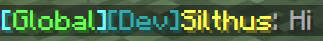

#### `active_color`

[:octicons-milestone-24: next][next] · [`color`][color] · :octicons-pin-24: `green` · :octicons-sync-24:

Controls the color of the tab when it is **active**. This setting is only applied if the channel [`name`][channel-name] has no color.

```yaml
active_color: "#5099d4"
```

#### `active_decoration`

[:octicons-milestone-24: next][next] · [`decoration`][decoration] · :octicons-pin-24: `underlined` · :octicons-sync-24:

Controls the decoration of tab when it is **active**.

```yaml
active_decoration: "bold"
```

#### `inactive_color`

[:octicons-milestone-24: next][next] · [`color`][color] · :octicons-pin-24: `green` · :octicons-sync-24:

Controls the color of the tab when it is **inactive**.

```yaml
inactive_color: "gray"
```

#### `inactive_decoration`

[:octicons-milestone-24: next][next] · [`decoration`][decoration] · :octicons-pin-24: `underlined` · :octicons-sync-24:

Controls the decoration of tab when it is **inactive**. Use `null` to apply no decoration.

```yaml
inactive_decoration: null
```

#### `highlight_unread`

[:octicons-milestone-24: next][next] · `boolean` · :octicons-pin-24: `true` · :octicons-sync-24:

Set to `false` to disable all unread message indicators on the tab.

```yaml
highlight_unread: false
```

#### `unread_color`

[:octicons-milestone-24: next][next] · [`color`][color] · :octicons-pin-24: `green` · :octicons-sync-24:

Controls the color of the tab when it contains **unread messages**.

```yaml
unread_color: "gray"
```

#### `unread_decoration`

[:octicons-milestone-24: next][next] · [`decoration`][decoration] · :octicons-pin-24: `underlined` · :octicons-sync-24:

Controls the decoration of tab when it contains **unread messages**. Use `null` to apply no decoration.

```yaml
unread_decoration: null
```

#### `message_format`

[:octicons-milestone-24: next][next] · [`minimessage`][minimessage] · :octicons-sync-24:

The message format controls how message are displayed for the given channel.  
In addition to the [PlacerholderAPI][placeholderapi], the following placeholders are supported:

!!! tip
    With sChat you have something completly new: **Tabbed Chat Channels**  
    This gives you the power to declutter your chat and remove the now unneeded `[Channel]` prefix from the messages.

| Placeholder | Description | Example | Since |
| ----------- | ------- | -------- | -------: |
| `<id>` | The unique id of the message. | `66ad5e0d-ed28-4601-bcde-617b6729b5b3` | [:octicons-milestone-24: next][next] |
| `<timestamp>` | The timestamp when the message was sent. | `2021-05-01T12:10:55.412386200Z` | [:octicons-milestone-24: next][next] |
| `<type>` | The type of the message. | `SYSTEM` or `CHAT` | [:octicons-milestone-24: next][next] |
| `<text>` | The text of the message. | `Hi there!` | [:octicons-milestone-24: next][next] |
| `<source_uuid>` | The ID of the message sender. | `dd5c4f63-b5d9-43e7-9584-40b25494d7e8` | [:octicons-milestone-24: next][next] |
| `<source_name>` | The name of the message sender. | `Silthus` | [:octicons-milestone-24: next][next] |
| `<source_display_name>` | The formatted display or nickname of the sender. | `&aSilthus` | [:octicons-milestone-24: next][next] |
| `<channel_key>` | The unique key of the channel. | `global` | [:octicons-milestone-24: next][next] |
| `<channel_display_name>` | The formatted name of the channel. | `Global` | [:octicons-milestone-24: next][next] |

??? example "Example with Name Hover and PlaceholderAPI"

    ```yaml
    message_format: "<aqua>[<channel_name>]</aqua>%vault_prefix%<hover:show_text:'<source_display_name>\n<gray>Rank: <aqua>%vault_rank%'><source_display_name></hover>%vault_suffix%<gray>: <text>"
    ```

    
    

#### `self_message_format`

[:octicons-milestone-24: next][next] · :octicons-beaker-24: Experimental · [`minimessage`][minimessage] · :octicons-sync-24:

Controls the format of messages where the viewer is also the sender of the message. Behaves exactly the same as `message_format` and exposes identical placeholders.

[next]: https://github.com/sVoxelDev/sChat/releases/latest
[developer]: /developer
[commands]: /commands
[messenger]: reference.md#messenger
[minimessage]: minimessage.md
[color]: minimessage#color
[placeholderapi]: /extensions/placeholderapi
[channel-name]: channels#name
[decoration]: minimessage#decoration