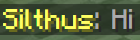
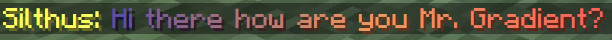

# MiniMessage Format

The [MiniMessage Format][minimessage] is a special parser that makes reading formatted messages a lot easier.  

!!! tip
    You can use the [MiniMessage Web Viewer][webviewer] to test your formats and preview them without a running server.

## Examples

The following examples all set the [`message_format`][message-format] of the channel. Formatting the messages sent to the channel.

!!! info
    You can click on the images to open the web viewer with the example and play around with it.

[{align=right}](https://webui.adventure.kyori.net/?mode=chat_closed&input=%3Cyellow%3E%3Csource.display_name%3E%3Cgray%3E%3A%20%3Ctext%3E&bg=grass&st=%7B%22channel.name%22%3A%22Global%22%2C%22text%22%3A%22Hi%22%2C%22channel.key%22%3A%22global%22%2C%22source.name%22%3A%22Silthus%22%2C%22source.display_name%22%3A%22Silthus%22%7D)

```yaml
message_format: "<yellow><source.display_name><gray>: <text>"
```

<hr>

[{align=right}](https://webui.adventure.kyori.net/?mode=chat_closed&input=%3Chover%3Ashow_text%3A'%3Csource.name%3E'%3E%3Csource.display_name%3E%3C%2Fhover%3E%20%3E%20%3C%23fa9411%3E%3Ctext%3E&bg=grass&st=%7B%22channel.name%22%3A%22Global%22%2C%22text%22%3A%22Hi%22%2C%22channel.key%22%3A%22global%22%2C%22source.name%22%3A%22Silthus%22%2C%22source.display_name%22%3A%22Silthus%22%7D)

```yaml
message_format: "<hover:show_text:'<source.name>'><source.display_name></hover> > <#fa9411><text>"
```


<hr>

```yaml
message_format: "<yellow><source.name>: <gradient:#5e4fa2:#f79459:red><text></gradient>"
```

[](https://webui.adventure.kyori.net/?mode=chat_closed&input=%3Cyellow%3E%3Csource.name%3E%3A%20%3Cgradient%3A%235e4fa2%3A%23f79459%3Ared%3E%3Ctext%3E%3C%2Fgradient%3E%20&bg=grass&st=%7B%22channel.name%22%3A%22Global%22%2C%22text%22%3A%22Hi%20there%20how%20are%20you%20Mr.%20Gradient%3F%22%2C%22channel.key%22%3A%22global%22%2C%22source.name%22%3A%22Silthus%22%2C%22source.display_name%22%3A%22Silthus%22%7D)

!!! tip
    Visit the official [MiniMessage Documentation][minimessage] for even more cool features and in depth explanation.

[message-format]: channels.md#message_format
[minimessage]: https://docs.adventure.kyori.net/minimessage/format.html
[webviewer]: https://webui.adventure.kyori.net/?mode=chat_closed&input=%3Caqua%3E%5B%3Cgreen%3E%3Cchannel.name%3E%3C%2Fgreen%3E%5D%3C%2Faqua%3E%3Cdark_aqua%3E%5BDev%5D%3Cyellow%3E%3Chover%3Ashow_text%3A'%3Csource.display_name%3E%0A%3Cgray%3ERank%3A%20%3Caqua%3EDev'%3E%3Csource.display_name%3E%3C%2Fhover%3E%3C%2Fyellow%3E%3Cgray%3E%3A%20%3Ctext%3E&bg=grass&st=%7B%22channel.name%22%3A%22Global%22%2C%22text%22%3A%22Hi%22%2C%22channel.key%22%3A%22global%22%2C%22source.name%22%3A%22Silthus%22%2C%22source.display_name%22%3A%22Silthus%22%7D
