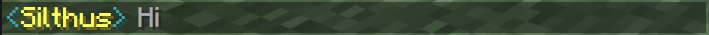

# Configuration Reference

These are all of the available config options for sChat.

!!! question "Looking for the channel settings?"
    Head over to the seperate [channel configuration][channels] section.

## General Settings

### `debug`

[:octicons-milestone-24: next][next] · `true` | :octicons-pin-24: `false`

Set to `true` and restart your server to produce an enormous amount of debug logs.

## Private Chat

The following options control how private chats behave.

### `message_format`

[:octicons-milestone-24: next][next] · :octicons-beaker-24: Experimental · :octicons-sync-24: Reloadable · `string`

Controls how messages are displayed inside private chats. By default this will render the name of the chat partner and `You:`.

--8<-- "docs/partials/_minimessage.md"

```yaml title="Example"
private_chat:
    message_format: "<dark_aqua><<yellow><source.display_name><dark_aqua>> <gray><text>"
```

[](https://webui.adventure.kyori.net/?mode=chat_closed&input=%3Cdark_aqua%3E%3C%3Cyellow%3E%3Csource.display_name%3E%3Cdark_aqua%3E%3E%20%3Cgray%3E%3Ctext%3E&bg=grass&st=%7B%22channel.name%22%3A%22Global%22%2C%22text%22%3A%22Hi%22%2C%22channel.key%22%3A%22global%22%2C%22source.name%22%3A%22Silthus%22%2C%22source.display_name%22%3A%22Silthus%22%7D)

## Global Chatting

The following settings control how global chatting works. Changing one of these settings requires a restart of all affected servers and the proxy.

### `messenger`

[:octicons-milestone-24: next][next] · `string`

The messenger controls how [`global`][channels] messages are forwarded to the other servers in the network.

| Type | Description | Since |
| ---- | ----------- | ----- |
| `pluginmessage` :material-check-all: | Messages are sent thru the [Plugin Messaging Channel][pluginmessage] to the proxy. The proxy then forwards them to all other servers in the network. **sChat must be installed on the proxy** for this to work. | [:octicons-milestone-24: next][next] |

[channels]: channels.md
[minimessage]: minimessage.md
[next]: https://github.com/sVoxelDev/sChat/releases/latest
[pluginmessage]: https://www.spigotmc.org/wiki/bukkit-bungee-plugin-messaging-channel/
